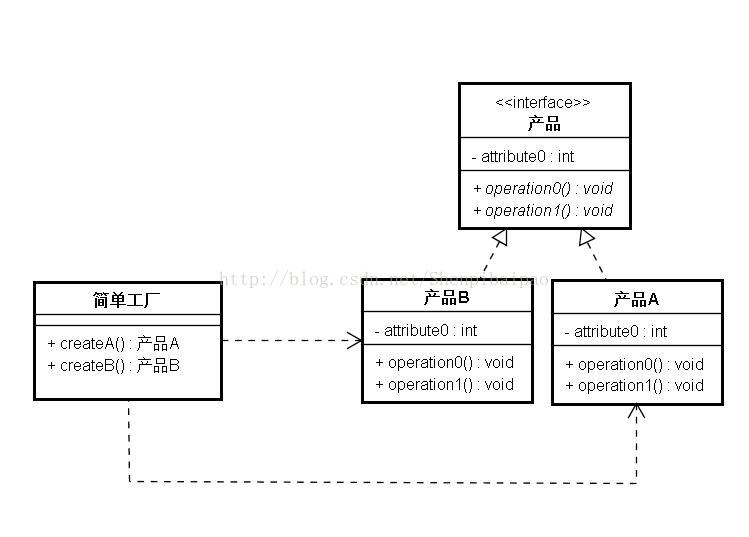
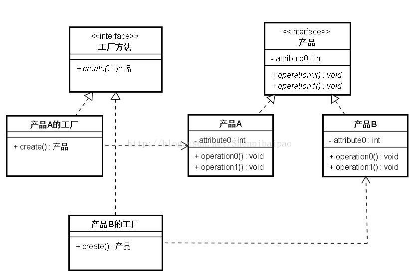
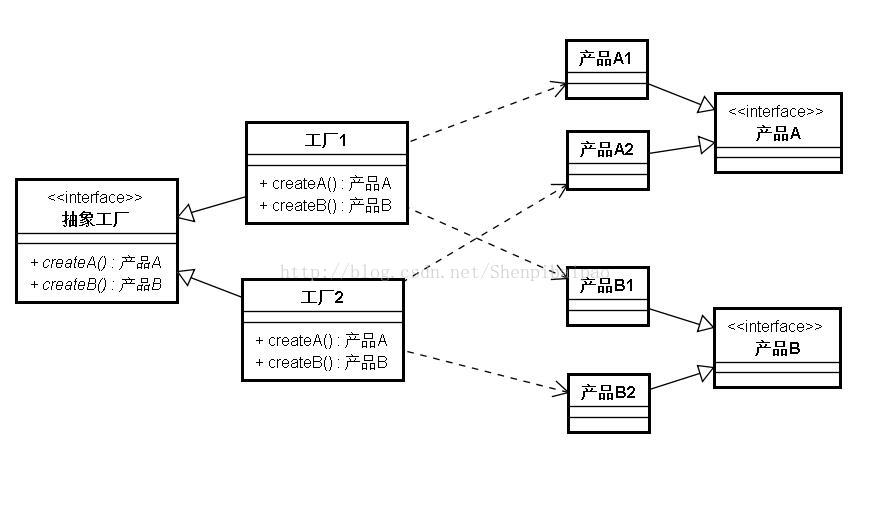

# 设计模式(一)：工厂模式 简单工厂|静态工程、工厂方法|多工厂、抽象工厂

## 什么是工厂模式

工厂模式是一种创建模式，是指定义一个创建对象的接口，让实现这个接口的类来决定实例化哪个类。

## 用途

其一般用于：

- 当构建一个对象并使其达到可用状态时，需要大量的代码，且系统中对该对象有大量的需求时；
- 对一组相近的类，为了便于管理，用工厂模式定义他们间统一的构造方式。

## 工厂模式的几个常见方式

### 1.简单工厂|静态工厂



其实简单工厂方法和静态方法、接受参数创建类的这三种方法没啥差别，只在工厂内部有差，对外是没有区别的。个人偏向使用create+产品名的方法构建简单工厂，方便IDE补全。如果是接受参数（比如字符串）构建工厂，不去看API说明谁知道这些字符串到底能不能用，IDE也不会报错，如：

```kotlin
class Fatory1{//方法名构建
    fun createA(){return A()}
    fun createB(){return B()}
}
class Fatory2{//接受参数构建
    fun create(s:String){
         when(s){
              "A" -> return A()
              "B" -> return A()
         }
    }
}
```

显然，上面这段kotlin代码中，Factory1的写法比Factory2的写法，在IDE报错、查看时更具有优势，更直观和更便于维护。

简单工厂的方法的优点就是写起来简单，但是并不符合OCP（开闭原则）。

### 2.工厂方法|多工厂模式

工厂方法，也叫多工厂模式。其一般指的是，对每种产品单独创建一个工厂专门进行生产。首先，看其类图：



这个模式的优点在于其可扩充性，扩充产品时符合OCP（开闭原则），但其对产品组的扩充性不足。

```kotlin
//工程类
interface GunFactorys{
    fun produceGun():Gun
}
class USPFactory:GunFactorys{
    override fun produceGun(): Gun {
        return USP()
    }
}
class AK47Factory:GunFactorys{
    override fun produceGun(): Gun {
        return AK47()
    }
}
//武器类
interface Gun{
    val ammo:Int
    fun fire()
    fun reload()
}
class USP:Gun{
    override val ammo: Int = 28
    override fun fire(){
        println("${this.javaClass} fire!")
    }
    override fun reload() {
        println("${this.javaClass} reloading!")
    }
}
class AK47:Gun{
    override val ammo: Int = 30
    override fun fire(){
        println("${this.javaClass} fire!")
    }
    override fun reload() {
        println("${this.javaClass} reloading!")
    }
}
//如果我要扩充一个M4A1的产品线，直接写个新的工厂和武器类就好了，不需要修改原代码
class M4A1:Gun{
    override val ammo: Int = 30
    override fun fire(){
        println("${this.javaClass} fire!")
    }
    override fun reload() {
        println("${this.javaClass} reloading!")
    }
}
class M4A1Factory:GunFactorys{
    override fun produceGun(): Gun {
        return M4A1()
    }
}
```

### 3.抽象工厂

抽象工厂的方法更多的用来生产一个产品组/簇，见下面的类图：



可以看到，工厂1需要同时生产产品A和产品B，工厂2亦如是，其均继承了抽象工厂接口中的抽象方法。举个例子来理解这个抽象工厂：工厂1是伊利，工厂2是蒙牛，他们都生产牛奶（产品A）和奶粉（产品B），产品类别是一样的，但牌子（工厂）和具体成分（产品类属性）是不一样的。

抽象方法对产品的扩展依旧是无法实现的，比如上面那个图，要想增加一个产品C，就要修改抽象工厂中的方法，直接违背了OCP。

其使用情形主要如下：

<span style="color: #ff9933;font-weight: bold;">

- 产品种类固定，但对产品的组合较为频繁变化。比如上图中增加一个工厂3，他只生产产品A，不违背OCP，同时扩展方便。
- 需要一次性生产一组产品时。比如工厂1需要生产产品A和产品B。

</span>

## 工厂模式的区别

<span style="color: #ff9933;font-weight: bold;">

- 简单工厂：对新增的产品无法进行基于OCP的扩展；可生产同一等级的任意产品；对OCP的支持程度最低；
- 多工厂：对新增的产品可以做到基于OCP的扩展；可生产统一等级结构中的固定产品；对OCP的支持程度最高；
- 抽象工厂：对新增的产品无法进行基于OCP的扩展；其适用环境见上文；在其适用环境中，对OCP的支持程度最高；抽象工厂模式，符合合成复用原则（CRP）。

</span>

参考文章：<http://blog.csdn.net/superbeck/article/details/4446177>