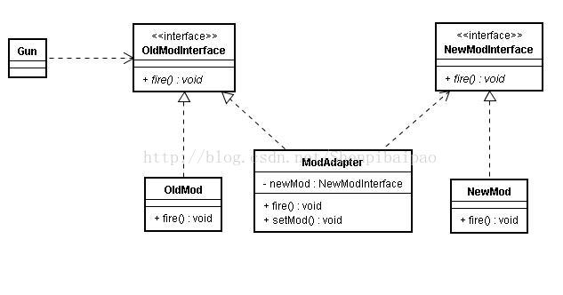
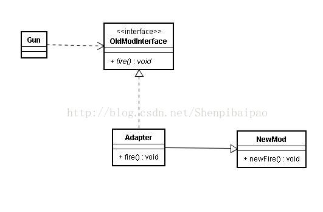
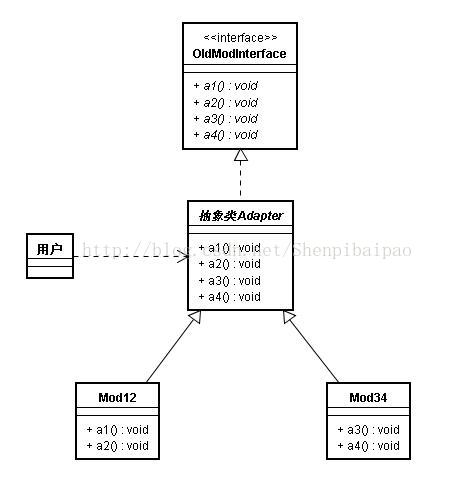

# 设计模式(四)：适配器模式 Adapter 类适配器、对象适配器、接口适配器

## 什么是适配器模式？

适配器模式是一种结构性模式，其用处是用来衔接、扩展、适配旧的接口和新的接口，本身也隐含了委托/代理模式的思想。适配器模式本身包含三种：__类适配器、对象适配器、接口适配器__。本文着重介绍最常用的对象适配器模式。

适配器模式与代理模式的区别是啥呢？其实要你的实现的目的。如果只是简单的两个接口的转发适配，那它就是适配器模式。如果转发实现的时候又加上了一些其它的通用逻辑（比如缓存，权限，日志等）那它就成了代理模式。

出发点不一样。适配器模式里加上了日志或缓存处理就成了代理模式。

## 适配器模式样例

观察下面的样例代码：(对象适配器模式，最常用的适配器模式)

```kotlin
//旧的Mod接口及其实现类
interface OldModInterface{
    fun fire()
}
class OldMod:OldModInterface{
    override fun fire() {
        println(".330mm")
    }
}
//只适配了旧的接口的枪
class Gun{
    lateinit var gunFireMod:OldModInterface
    fun setFireMod(mod:OldModInterface){////只适配了旧的接口
        gunFireMod = mod
    }
    fun fire(){
        gunFireMod.fire()
    }
}
//新的Mod接口及其实现类
interface NewModInterface{
    fun fire()
}
class NewMod:NewModInterface{
    override fun fire() {
        println(".340mm")
    }
}
//通过适配器把新的Mod适配到旧的Mod接口上
class ModAdapter:OldModInterface{//继承旧的接口（向上转型）
    lateinit var mod:NewModInterface//对象适配
    fun setAdapter(newMod:NewModInterface){//接受一个新的Mod对象，也可以写在构造函数里
        mod=newMod
    }
    override fun fire() {//重写旧接口中的方法
        mod.fire()//把新的Mod的开火方法，替代旧接口中的开火方法。这里实际上隐藏了委托模式的思想
    }
}
```

这又不得不提到我们的老朋友OCP（开闭原则）了。我对Gun的功能做扩展和修改，让他使用新接口的方法。观察到我写了一个适配器类，在保留旧接口及Gun类源代码不动的基础上，通过扩展实现了Gun使用新Mod的需求：

```kotlin
fun main(args:Array<String>){
    val g = Gun()
    g.setFireMod(OldMod())
    g.fire() // 射出.330mm子弹

    val newModWithAdapter = ModAdapter()
    newModWithAdapter.setAdapter(NewMod())
    g.setFireMod(newModWithAdapter)
    g.fire() // 射出.340mm子弹
}
```

为了更便于阅读，可以看下面这个类图(对象适配器模式)：



## 如何构造对象适配器

构造对象适配器的要点是：

<span style="color: #ff9933;font-weight: bold;">

- 实现旧接口；
- 重写旧接口的方法，需要被新接口替代的方法，用新接口的对象的相关方法实现；（即委托）
- 适配器接受一个新接口的对象。

</span>

## 其他适配器模式：类适配器模式、接口适配器模式

这两种适配器模式比较简单，分别介绍一下：

### 类适配器模式：

- 适配器类实现[旧的接口]并继承[新的接口实现类]；
- 在适配器中，桥接、重写旧接口的适配器方法。

```kotlin
class OldModInterface{
     fun fire()
}
open class NewMod:NewModInterface{
     override fun newFire(){...}
}
class Adapter:NewMod(),OldModInterface{
     override fun fire(){
           super.newFire()
     }
}
```



类适配器显然没有对象适配器灵活，但胜在代码简短，在一些简单的接口适配和扩展中要更好用一点。

### 接口适配器

接口适配器与上面的适配器模式都不太一样，其目的是用来优化一个过大的接口的，其符合接口隔离原则。

示例代码：

```kotlin
//一个过于臃肿的接口
interface BigInterface{
    fun a1()
    fun a2()
    fun a3()
    fun a4()
}
//一个抽象类实现了接口的所有方法
abstract class Adapter:BigInterface{
    override fun a1(){}
    override fun a2(){}
    override fun a3(){}
    override fun a4(){}
}
//具体的实现类并不需要重写所有接口中的方法
class Mod12:Adapter(){
    override fun a1(){
        println("a1")
    }
    override fun a2(){
        println("a2")
    }
}
class Mod34:Adapter(){
    override fun a3(){
        println("a3")
    }
    override fun a4(){
        println("a4")
    }
}

//使用时，只需要：
val d:Adapter = Mod12()
d.a1()//只需要用这个接口的a1和a2方法
```



 接口适配器最常见的就是JAVA GUI中监听器的事件适配器了，例如MouseAdapter类。

## adapter模式和proxy模式的区别

- 适配器: 将一个类的接口转换成客户希望的另外一个接口. 解决接口不兼容问题.
- 代理: 控制对这个对象的访问.

其实很多设计模式的实现都是类似的，其实都是遵循依赖倒置 现象接口编程，所以你看起来都感觉相似。

设计模式还有个作用就是用来方便描述所用的方式，方便开发人员沟通。

Adapter就是让你知道 你用别的东西，但是跟你现在的代码部分的方法名字不一样，你的代码中大量用了你自己的方法，现在你发现别人写的一个更好的类 可以更好的解决现在的问题， 于是你就要大量修改你的代码 就为了改很多方法的名字 这个时候用Adapter模式

proxy 意思很明确就是东西要干的什么 通过另一个东西来解决（但是这里不需要改变接口方法名字）
