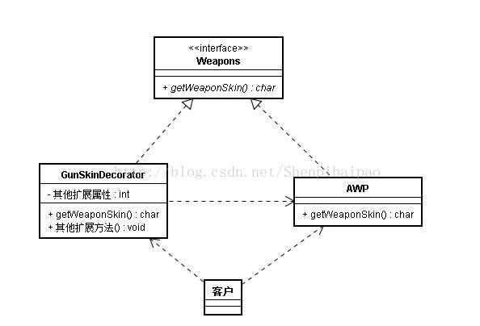
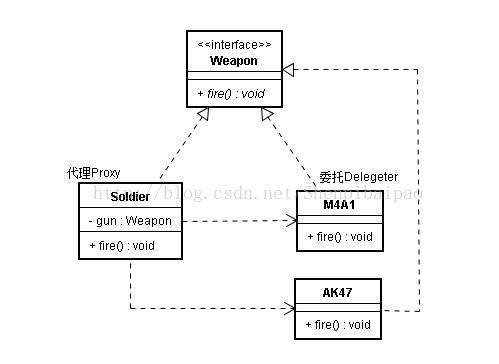

# 设计模式(五)：装饰器模式(Decorator)和代理模式(Proxy)|委托模式(Delegater)

代理模式和委托模式其实是一个东西，文字游戏罢了，待会儿我们再细讲，这两个模式今天统称代理模式。

装饰器模式和代理模式也是结构模式（之前讲过的适配器模式也是结构模式）。

## 什么是装饰器模式？

装饰器模式，是指对一个类的功能进行扩展，同时保证不修改原类的代码，遵循OCP（开闭原则）。装饰器模式最大的使用例子就是JAVA的IO库。但我个人觉得JAVA的IO库完美体现了装饰器模式的 __缺点：产生过多相似的类，理解困难__。

举个小例子，假如我是CSGO的开发者，要为游戏添加新的系统。要知道早期CSGO是没有武器涂装这个系统的，那么此刻我要为武器加上涂装功能，该怎么办呢？

```kotlin
//武器类的接口
interface Weapons{
    fun getWeaponSkin():String
}
//武器类的一个实现类
class AWP:Weapons{
    override fun getWeaponSkin():String{
        return "AWP皮肤"
    }
}
//动态地扩展功能，使其能够拥有换皮肤的功能
class GunSkinDecorator:Weapons{//实现同一个接口的装饰类
    private lateinit var myGun:Weapons
    private lateinit var mySkin:String
    fun setGun(gun:Weapons){
        myGun = gun
    }
    fun setSkin(skinName:String){
        mySkin=skinName
    }
    override fun getWeaponSkin():String {//重写接口的功能
        return mySkin+myGun.getWeaponSkin()
    }
}

//这样，在使用时：
fun main(args:Array<String>) {
    val myAWP = AWP()
    println(myAWP.getWeaponSkin()) // 输出AWP，没有换皮肤的功能

    val gsD = GunSkinDecorator()
    gsD.setGun(myAWP)
    gsD.setSkin("阿西莫夫 ")
    println(gsD.getWeaponSkin())//阿西莫夫 AWP皮肤，完成了换皮肤功能
}

```



使用场景：

<span style="color: #ff9933;font-weight: bold;">

- 需要动态地扩展一个类的功能时，非常灵活，可增可消。（注意，继承只能静态地扩展，无法消去）。
- 装饰模式用于弥补类继承模式无法遵循里氏代换原则的不足。

</span>

## 什么是代理模式？

其实在依赖反转原则中，我举的例子就是一个代理模式的具体应用：

```kotlin
interface WeaponAction{  
     abstruct fun fire()  
}  
class M4A1:WeaponAction{  
     override fun fire(){  
          println("士兵使用M4A1开火了")  
     }  
}  
class AK47:WeaponAction{  
     override fun fire(){  
          println("士兵使用AK47开火了")  
     }  
}  
//注意这里，士兵Soldier的开火方法fire()其实是委托给具体的WeaponAction实现类（比如M4A1）去做的。这就是一种委托关系。而士兵则是执行枪开火操作的代理人。  
class Soldier{  
     fun fire(gun:WeaponAction){  
          gun.fire()  
     }
}
```



刚刚说了代理模式和委托模式其实是一个东西，看上面这个图，可以知道，Soldier就是一个Proxy（代理），他代理的是具体Weapon接口实现类的fire()方法。编程者不需要调用每把枪的开火方法，只需要把某把具体的枪交给代理(也就是士兵)，士兵执行fire()方法。士兵就是一个代理。

当士兵执行fire()方法时，他本身并不关心到底是怎么开火的，只知道枪可以开火，于是委托枪开火。枪（M4A1、AK47....）就是委托。

就这么简单，这个开发模式的依照的基本原则是>OCP、依赖反转、DP<。如果对这些设计原则毫无概念，建议去>看一遍<。

### 代理模式的扩展定义

代理模式的扩展主要有三种：

- __普通代理__：用户只能访问代理者，不能接触到真实的执行者；（比如上面那个例子，用户不能直接接触到枪并让其开火）
- __强制代理__：用户只能通过真实执行者找到其代理；（如果你要寻求某个演员参演电影，就必须通过他找到他的经纪人（代理），并进行洽谈）
- __虚拟代理__：当需要的时候才初始化具体的主题类，避免委托对象太多开销巨大。（例子见上，只有让士兵fire时，才会交给他一把枪；而不是一次性给他所有枪（的实例）。

再细分下去还有动态代理、静态代理，这个其实大部分时候都不要关心。

更简单地说，动态代理就是虚拟代理，其余两种都是静态代理。

### Proxy 与 delegate 的区别

- proxy :译为代理， 被代理方（B）与代理方（A）的接口完全一致。 主要使用场景（语义）应该是：为简化编程（或无法操作B），不直接把请求交给被代理方（B），而把请求交给代码方（A），由代理方与被代理方进行通信，以完成请求。
- delegete : 译为委托，主要语义是：一件事情（或一个请求）对象本身不知道怎样处理，对象把请求交给其它对象来做。

代理模式（proxy）要求更为严格；

委托模式（delegate）：可以让一个对象扮演另外对象的行为，如下图为对请求的委托（delegate pipeline）

从词性上看，代理(Proxy)是名词，委派(Delegate)是动词，代理说明了若干个对象实现了一个共同的接口，而委派只是说明一个对象引用了另一个对象，并不涉及接口。
