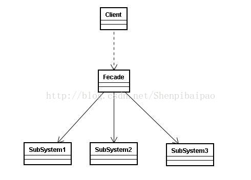
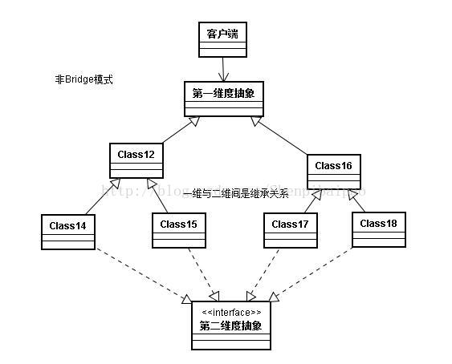
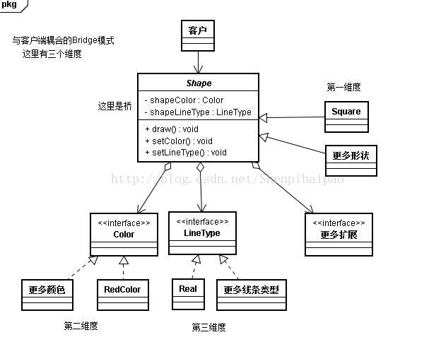
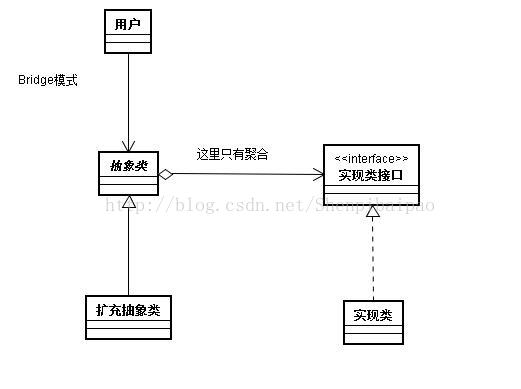

# 设计模式(六)：外观模式(Fecade)与桥接模式(Bridge)详解

外观模式(Fecade)与桥接模式(Bridge)都属于结构模式，与之前提到的建造者模式、代理模式、装饰器模式同属一类。

## 什么是外观模式？

要想知道为什么要设计外观模式，就要讲讲它基于的>基本设计原则<：迪米特法则(DP)。

外观模式是指，通过对内的包装，对外只暴露预定的外观类。

举个例子，对于启动电脑，用户只需要按一下开机键就可以了，而实际上电脑要经过主板过电、硬盘自检、内存过电等操作，而这些操作都被包装起来了，对用户而言，就只有一个按下开机键的动作。

在抽象层面，子系统类被包装成一个Fecade类，客户类只需要知道Fecade类，而不需要知道复杂的子系统运作方式。听起来有点像建筑模式（Builder），都是把复杂的内容包装起来，以供简单调用。

其UML图如下：



外观模式的 __优点__ 有：

<span style="color: #ff9933;font-weight: bold;">

- 客户与系统解耦，客户对子系统的使用更简单；
- 便于系统的阅读和理解；
- 子系统单独的修改不会影响到外观类，符合OCP(开闭原则)
- 未对子系统进行修改，用户仍可以单独调用某一个子系统。

</span>

相对的，其 __缺点__ 也很明显：

<span style="color: #ff9933;font-weight: bold;">

- 客户与系统解耦，却和外观类耦合上了；
- 由于客户与外观类耦合了，一旦子系统发生增删，外观类也要进行修改，直接违背了OCP(开闭原则)；（缓解方法是对外观类进行抽象，但这又容易加大了代码量和冗余）
- 不完全杜绝客户对子系统的干涉，对敏感系统，可能会造成隐患。

</span>

参考：<http://blog.csdn.net/hguisu/article/details/7533759>

## 什么是桥接模式？

先说一个很抽象的概念吧：__桥接模式（Bridge） 目的在于把抽象类和实现类解耦，使得二者可以独立变化__。

然后我们说一个实际的例子吧：假设我们有一个Shape抽象类，其被继承为正方形类、长方形类等，如果又要定义出红色的正方形、绿色的正方形、红色的长方形等，又要进一步向下继承，UML图如下：



那么这样，整个系统的类数量就非常大了，这对系统的维护是一个非常大的隐患。假如，我们又要对这个Shape类扩充一个线条类的关系，这下系统中类的数量就会出现立方级别的增长。

所以，桥接模式就是为了解决这个问题而出现的，其依据的最主要的设计原则是>合成复用原则<。（理解设计原则对理解设计模式非常重要）。

现在，让我们用桥接模式来解决这个问题：

```kotlin
fun main(arg:Array<String>){
    val mySquare:Shape = Square()
    mySquare.setColor(RedColor())
    mySquare.setLineType(RealLine())
    mySquare.draw() // 输出 Draw Red 正方形 with Real ,桥接成功
}
//第一维度
abstract class Shape{
    lateinit var shapeColor:Color
    lateinit var shapeLineType:LineType
    fun setColor(c:Color){shapeColor=c}
    fun setLineType(lt:LineType){shapeLineType=lt}
    abstract fun draw()
}
//第二维度
interface Color{
    //这里简单用属性值的方式表示
    var color:String
}
//第三维度
interface LineType{
    var lineType:String
}
 
class RedColor:Color{
    override var color: String ="Red"
}
class RealLine:LineType{
    override var lineType: String = "Real"
}
//抽象类的实现类，实现了桥Bridge
class Square:Shape(){
    //三个维度均被耦合
    override fun draw() {
        println("Draw " + shapeColor.color + " 正方形 with " + shapeLineType.lineType)
    }
}
```

其UML图如下：



可以看到，原版的继承关系全部转化为了>聚合关系<。
参考：<http://www.cnblogs.com/chenssy/p/3317866.html>

### 桥接模式的结构及优缺点



桥接模式的 __优点__：

<span style="color: #ff9933;font-weight: bold;">

- 用聚合等关联关系代替继承，简化了系统；
- 桥接模式提高了系统的可扩展性，注意到，对各个维度的扩展均是独立饿。符合OCP（开闭原则）。
- 间接实现了对用户隐藏细节的功能。

</span>

桥接模式的 __缺点__：

<span style="color: #ff9933;font-weight: bold;">

- 理解难度与设计难度得到了提升，在类与类之间的关系进行抽象和建立时，对程序员的要求较高。
- 弱OCP，对扩展维度的需求必须修改桥Bridge。

</span>

参考：http://www.cnblogs.com/chenssy/p/3317866.html
