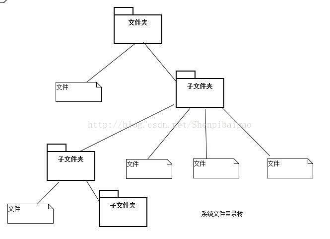
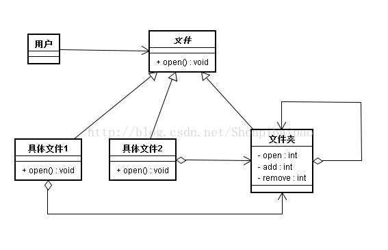
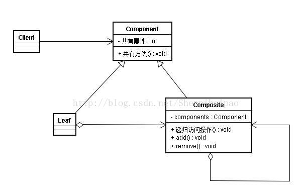
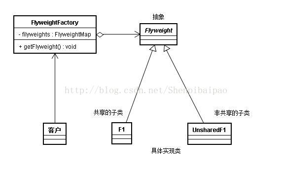

# 设计模式(七)：组合模式(Composite)与享元模式(Flyweight)详解

组合模式(Composite)与享元模式(Flyweight)都是结构模式，是七种结构模式中最后被介绍的两种。（其余的分别是装饰器、代理、外观、桥接）

## 什么是组合模式？

刚刚说过，组合模式是一种结构模式，他必然是用来解决某种结构问题的。

我们假设这么一个场景：当你在查看硬盘中某个文件时，无论是打开文件还是打开一个文件夹，都是双击打开，对于用户而言并没有什么区别。然而，实际上文件夹和具体的文件还是有区别的，观察下图：



显然，文件夹可以作为一个容器，包装文件；而文件只能作为一个树里的一片叶子。那么这就给代码的编写上造成了一定困难，因为我们希望这两个类对外具有相同的表现形式（如双击打开），该怎么做呢？

组合模式：__定义了如何将容器对象和叶子对象进行递归组合，使得客户在使用的过程中无须进行区分，可以对他们进行一致的处理__。

我们来看下面这个UML图，就定义了一个组合模式在文件系统中的具体应用：



用代码实现如下：

```kotlin
//顶层抽象类，包含一些共有的属性和方法
abstract class File{
    abstract var name:String
    abstract fun open()
}
//文件夹类-容器类
class Folder(n:String):File(){
    var files:MutableList<File> = mutableListOf() // 存储File的子部件
    override var name = n
    fun add(f:File){
        files.add(f)
    }
    fun remove(f:File){
        files.remove(f)
    }
 
    override fun open() {
        println("打开文件夹 $name")
    }
    //还可以添加查看子文件等方法，此处略
}
//具体的文件类-叶子
class Movie(n:String):File(){
    override var name = n
    override fun open() {
        println("打开电影 $name")
    }
}
class Txt(n:String):File(){
    override var name = n
    override fun open() {
        println("打开小说 $name")
    }
}

// 然后对用户而言，只需要面对容器类的对象，就可以对所有文件进行一致的操作了：
fun main(arg:Array<String>){
    val system = Folder("C盘")
    system.add(Movie("功夫熊猫"))
    system.add(Txt("从零开始"))
    system.add(Folder("子文件夹"))

    system.open()
}

```

### 如何使用组合模式

再来回顾组合模式的构建要点：

<span style="color: #ff9933;font-weight: bold;">

- 顶层抽象类Component，声明整个系统共有的操作和属性；
- 容器类Composite，继承顶层抽象类，要求有存储整个顶层抽象类对象的数据结构，并提供相应的递归访问方法及增删改方法等；
- 叶子对象Leaf，继承顶层抽象类，实现顶层抽象类中的抽象内容，不存在子节点。

</span>

其UML图如下：



最后，顺便说一下组合模式基于SRP、DP、LSP原则的结构模式。

推荐这篇文章：<http://cmsblogs.com/?p=140>

## 什么是享元模式？

OOP程序员面对的一个问题就是，虽然编程直观，但编程过程中难免产生了大量的对象，非常占内存。

这一点在进行游戏编程时非常明显。举个例子，GTAV这款游戏了满满当当都是车，那么难道把一整个城市的车全部存在内存里？显然是不可能的。

享元模式，__本质上是一个缓存池，目标是实现对大量细化颗粒对象的复用__。

其UML图如下：



其中，当执行getFlyweight时，若相应的享元不存在，就插入共享池（缓冲池）并给出，否则就冲缓冲池里取出一个。

上面的UML图中还提到了一个非共享的子类，是什么意思呢？当一个享元抽象类的子类不会被大量创建，同时需要独立、单独保存时，该类时不被缓冲池接受的。举个例子，游戏中有无数个NPC，这些都是享元，但只有若干个带有任务事件的NPC，这些NPC是唯一的、受外部状态影响的，显然这些个NPC不能被共享池来回地给出，这就是非共享的子类（NPC抽象类的子类，他们或许与其他NPC有相同的行为模式，但他们是受外部影响的）。

参考及代码例子：<http://www.cnblogs.com/chenssy/p/3330555.html>
