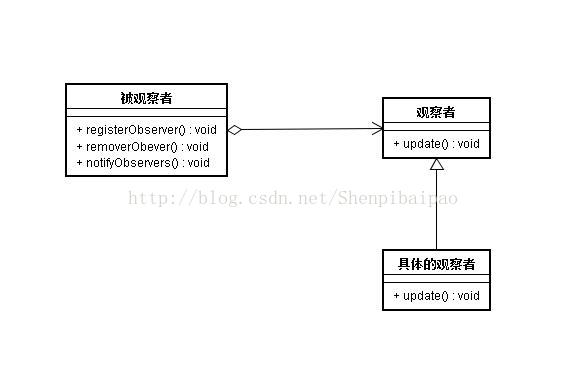
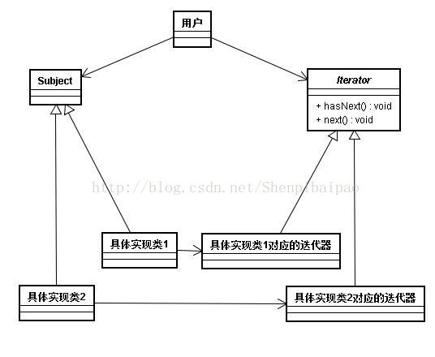
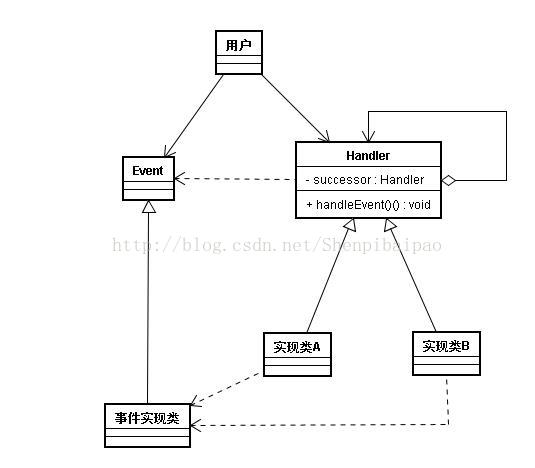
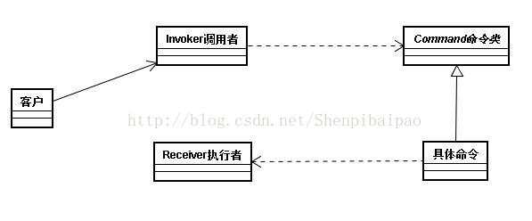

# 设计模式(十)：观察者模式|迭代器模式|责任链模式|命令模式(四种类间行为模式)

在 设计模式(九)：策略模式(Strategy)与模板模式(Template)详解及二者间区别介绍(两种父子类行为模式) 中我们对11种行为模式进行了分类，并介绍了的父子关系类中的 __策略模式与模板模式__。

今天讲讲四种类间关系类的行为模式：观察者模式、迭代器模式、责任链模式、命令模式。

## 什么是观察者模式

观察者模式定义了一种一对多的依赖关系，当被观察对象状态改变时，所有观察者都能收到信息。（又被称为发布-订阅模式）

先上一个UML图，然后由实例引出具体的实现：



在玩CS游戏时，如果一个玩家被击杀，在积分榜单和右上角都会有提示和记录。这是怎么做到的呢？看下面这个代码：

```kotlin
abstract class Roles{//被观察者
    val scoreBorads:MutableList<Borad> = mutableListOf()//观察者的列表
    abstract val name:String
    abstract fun registerObserver(borad:Borad)//注册一个该对象的观察者
    abstract fun removeObserver(borad:Borad)//移除一个该对象的观察者
    abstract fun notifyObserver()//一旦自身状态改变，通知观察者
}
abstract class Borad(){//观察者
    abstract fun update(r:Roles)//观察者更新数据
}
//以上两个类的具体实现类
class CT(n:String):Roles(){
    override val name = n
    override fun registerObserver(borad:Borad) {
        scoreBorads.add(borad)
    }
    override fun removeObserver(borad:Borad) {
        scoreBorads.remove(borad)
    }
    override fun notifyObserver() {
        scoreBorads.forEach { it.update(this) }
    }
    fun getKill(){//若该玩家被击杀
        notifyObserver()//通知所有的观察者
    }
}
class TabBorad:Borad(){
    override fun update(r:Roles) {
        println("${r.name} 被击杀！")
    }
}
```

可以看到，当Role的实现类CT被击杀时，观察者类的计分板TabBorad就会收到消息，并调用自身的update方法更新数据。

构建观察者模式的要点有：

- 被观察者类中存储有所有观察者对象的列表，并拥有相应的增删改方法；
- 被观察者类知道观察者类中对数据更新的方法，并在通知方法中调用；
- 观察者类中至少要有一个更新数据和接受被观察者类消息的方法，并暴露给被观察者。

该模式的优缺点很明显，首先其符合OCP，观察者和被观察者类间是弱耦合关系，只要update方法不变，两个类可以独立变化；但缺点也是有的，当观察者数量太多时，这种通知可能会有延迟，尤其是对于多级观察者，一级一级传递消息下去会有较大的空档期，要注意NULL的问题。

## 什么是迭代器模式

迭代器模式其实在JAVA中有专门的类Iterator和接口Iterable，使用时直接继承或实现接口即可，就像下面这样：

```java
class myMenu:MenuItem(),Iterator<String>{
    //list自带迭代器，我只是举个例子，就不再自己定义数据解结构了。
    var list:MutableList<String> = mutableListOf("f")
    var i = 0
    override fun hasNext(): Boolean {
        return try{
            list.get(i)
            true
        }catch (e:Exception){
            false
        }
    }
    override fun next(): String {
        println("yes $i")
        return list.get(i++)
    }
}
```

一旦实现了迭代器类和接口，就可以使用for(xx in xx)或for(Type var:Object)的方式直接遍历该对象中的每个被迭代的数据元素。

但其实也可以自己实现迭代器，如下面的UML图：



可以看到，迭代器模式就是提供了一种能顺序访问一个聚合对象的方法，并把该方法封装起来，不对外暴露，其设计原则是SRP。

很简单，不做过多的介绍了。需要知道的是，构建一个迭代器，需要带有两个方法hasNext():Boolean(上图中标错了，抱歉)和 next()方法，用于遍历整个数据结构。

## 什么是责任链模式？

责任链的模式最大的实例就是安卓的屏幕按键模式。当你点击屏幕上的一个地方，这个点击事件会被交给责任链，在链条上一级一级传递下去，直到被截获。

我们再来举一个例子，导弹拦截系统。对于不同当量的导弹，需要用不同级别的拦截器去拦截。我们希望对这个系统输入一个导弹的数据，系统能自动分析要用哪个级别的导弹拦截器去截获，设计如下：

```kotlin
//ChainofResponsibility
//导弹拦截器
abstract class MissileInterceptor{
    abstract val nextLevel:MissileInterceptor?//下一级处理者
    abstract fun handleEvent(e:Missile)//责任链必有的事件处理方法
}
//导弹类
abstract class Missile{
    abstract val equivalent:Int//导弹的当量
}
//初级拦截器
class normalMissileInterceptor(next:MissileInterceptor?):MissileInterceptor(){
    override val nextLevel: MissileInterceptor? = next
    override fun handleEvent(e:Missile) {
        if ( e.equivalent <= 1 ){
            println("初级拦截器已拦截导弹")
        } else {
            nextLevel?.handleEvent( e )
        }
    }
}
//高级拦截器
class updatedMissileInterceptor(next:MissileInterceptor?):MissileInterceptor(){
    override val nextLevel: MissileInterceptor? = next
    override fun handleEvent(e:Missile) {
        if ( e.equivalent <= 3 ){
            println("高级拦截器已拦截导弹")
        } else {
            nextLevel?.handleEvent( e )
        }
    }
}
//目标导弹
class myMissile:Missile(){
    override val equivalent: Int = 2
}

\\运行以下系统：

    val updated = updatedMissileInterceptor(null)//责任链
    val normalMI = normalMissileInterceptor(updated)
    val missile = myMissile()
    normalMI.handleEvent(missile)//把导弹事件交给责任链
```

输出结果：高级拦截器已拦截导弹。

责任模式的UML图如下：



其实现必须要有以下内容：

<span style="color: #ff9933;font-weight: bold;">

- 责任链中每一个对象必须存有下一个责任链的对象，并在handleEvent方法中对事件进行传递或截获；

</span>

## 什么是命令模式？

命令模式将命令发送者和命令执行者解耦，客户端不需要知道命令执行者具体如何执行命令，只需要知道如何使用控制器发布命令即可，在命令类中去指导命令执行者使用相关的操作，显然，其基于SRP、DP和OCP原则设计。
看下面这个例子：玩家使用控制器，操作游戏里的角色进行使用法术、跑步、使用药水的操作。

```kotlin
//控制器
class Controller{
    private val castSpellCom = CastSpell()//命令类set方法略
    fun castSpell(){
        castSpellCom.execute()
    }
    private val runCom = Run()
    fun run(){
        runCom.execute()
    }
    private val usePotionCom = UsePotion()
    fun usePotion(){
        usePotionCom.execute()
    }
}
//命令类
abstract class Command{
    abstract val player:Player
    abstract fun execute()
}
//命令实现类
class CastSpell(n:Player):Command(){
    override val player: Player = n
    override fun execute() {
        player.motion("使用法术")
    }
}
class Run(n:Player):Command(){
    override val player: Player = n
    override fun execute() {
        player.motion("跑动")
    }
}
class UsePotion(n:Player):Command(){
    override val player: Player = n
    override fun execute() {
        player.motion("使用药水")
    }
}
//命令执行者
class Player{
    fun motion(s:String){
        println(s)//简单用print代替执行了相关命令吧
    }
}
```



可以看到，玩家使用Controll就可以简单进行相关角色的操作，对于命令的扩展是符合OCP，但是对于控制器（也就是Invoke调用者）是非OCP的。

最后，命令模式的UML图如下：

## 总结

这四种行为模式主要目标都是用于解耦，但都无一例外的可能导致系统中的对象变多提高系统开销，因此在使用上需要考虑具体情境，若对扩展和耦合要求较高，建议使用以上方法来构筑系统。
