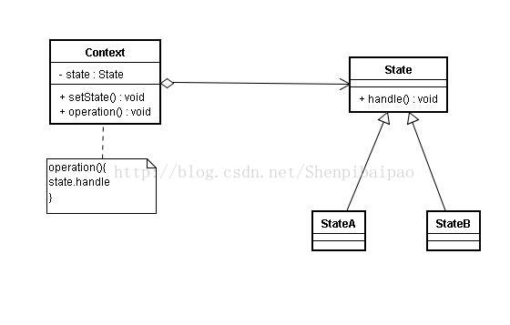

# 设计模式(十一)：备忘录模式(Memento)|状态模式(State) - (两种类状态行为模式)

上一篇我们讲了四种类间关系的行为模式，这次来说说两种类状态的行为模式：备忘录模式(Memento)|状态模式(State)。

## 什么是备忘录模式？

备忘录模式，最常见的用处就是Ctrl+z功能。简单来说，__就是记录一个对象的内部状态，以便在以后的任意时刻，在不破坏封装的情况下回退__。

但其缺点也是存在的，就是容易产生大量对象，增加系统开销。因此仅在需要快速还原系统运行时状态时使用备忘录模式，否则还是写Config会更好一些。

先看其UML图：


可以看到，备忘录模式的系统中有三个角色：

- __原发器Originator__：用于创建一个备忘录对象，记录/恢复自身的状态。  
- __备忘录Memento__：用于记录状态。数据对外不暴露，相关获取方法只对原发器开放。  
- __管理者Caretaker__：负责管理所有的备忘录，不能对备忘录数据进行操作，而是负责调度备忘录对象。  

举个例子吧，假设游戏中有一个骑士要去单挑BOSS，那么系统自动存档，当骑士挑战失败后可以读档：

```kotlin
//骑士，原发器
class Knight{
    var hp:Int = 100
    //保存状态
    fun saveMemento():Memento{
        return Memento(hp)
    }
    //还原状态
    fun restoreMemento(m:Memento){
        hp = m.hp
    }
}
//备忘录类
class Memento(h:Int){
    var hp = h //严格来说应该是private的，避免暴露。但此处从简。
}
//备忘录管理类
class Caretaker{
    private lateinit var memento:Memento//可以写成MAP或者任何一种储存形式，这里从简
    fun getMemento():Memento{
        return memento
    }
    fun setMemento(m:Memento){
        memento = m
    }
}

val careTaker = Caretaker()
val knight = Knight()
careTaker.setMemento(knight.saveMemento()) //存档
knight.hp-=50 //掉血
println(knight.hp) //输出50
knight.restoreMemento(careTaker.getMemento()) //回档
println(knight.hp) //输出100
```

## 什么是状态模式？

一个对象在不同时刻可能具有不同的状态，而在不同的状态下又有不同的行为（方法）；为了避免大量if-else语句或swich语句，我们引入了状态模式：__允许对象在内部状态发生改变时改变它的行为，对象看起来好像修改了它的类__。

其UML图如下：



该模式中有两个类：

- Context环境类：环境类中有其状态state，该环境受state的影响有不同的表现（operation）；  
- State状态类：状态类决定了某些环境在该状态下能执行怎样的操作。  

我们从一个例子说起：人在累得时候需要休息，在精神的时候才能正常工作，而工作之后又会变累。有以下状态转换tired-(sleep)->normal-(work)->tired。

```kotlin
// 状态类
abstract class State{
    abstract fun work(p:People)
    abstract fun sleep(p:People)
}
class Tired:State(){
    override fun work(p:People) {
        println("你很累了，不能工作 : Tired")
    }

    override fun sleep(p:People) {
        println("你得到了充分休息 Tired -> Normal")
        p.setState(Normal()) // 切换状态
    }
}
class Normal:State(){
    override fun work(p:People) {
        println("工作之后你很累 Normal -> Tired")
        p.setState(Tired()) // 切换状态，我这里简单new了一个状态对象，实际上增加了系统开销
    }
    override fun sleep(p:People) {
        println("你现在不需要休息 : Normal")
    }
}
//人，环境类
class People{
    private var state:State = Normal()//默认为正常状态
    fun setState(s:State){
        this.state = s
    }
    fun work(){
        state.work(this)//累的时候无法工作
    }
    fun sleep(){
        state.sleep(this)//精神的时候无法睡着
    }
}

val p = People()
p.work()//工作之后你很累 Normal -> Tired
p.sleep()//你得到了充分休息 Tired -> Normal
p.sleep()//你现在不需要休息 : Normal
p.work()//工作之后你很累 Normal -> Tired
```

状态模式封装了转换规则，减少了条件语句块；一个状态对象可以被多个环境类共享，某种意义上可以减少系统中的对象数目，但依旧增加了系统开销和对象数量；但其对OCP的支持度并不是很高，只能说对于增加状态类有着良好支持而对适配状态类的支持程度并不高。
