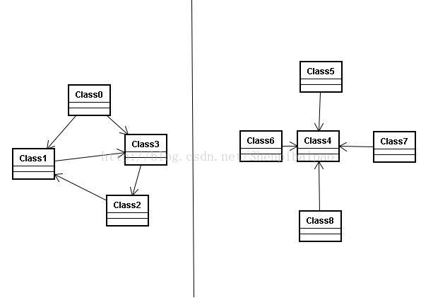
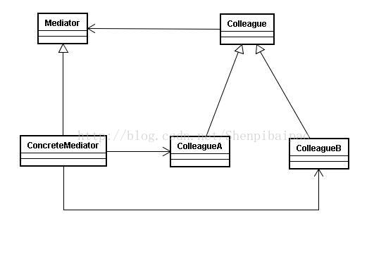
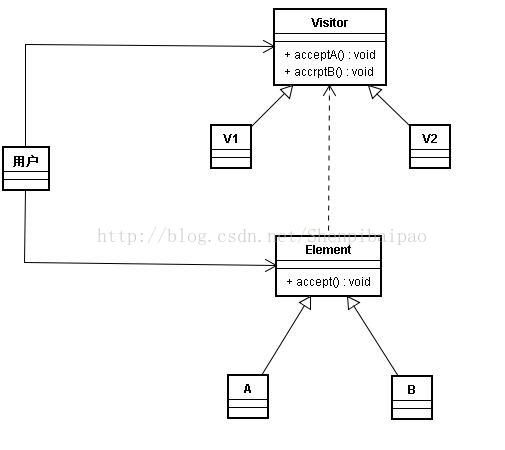
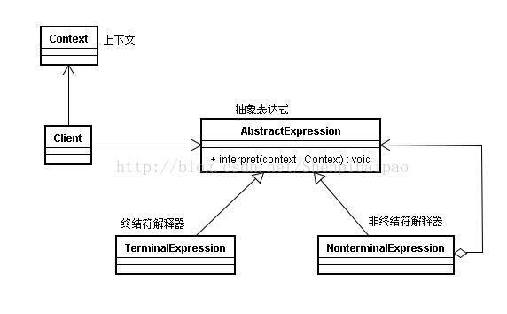

# 设计模式(十二)：中介模式|访问者模式|解释器模式(三种中间类行为模式)

上一篇<中介绍了两种类状态行为模式，这次介绍行为模式的最后三种——中间类行为模式：中介模式|访问者模式|解释器模式。

## 什么是中间模式

中介模式中，存在 __一个中介对象，封装了一系列对象的交互，使得各个对象间的交互由紧密网络变成松散的中心耦合状态__。简单来说，就是将下图中系统中的UML图变为右边的那样：



中介模式的UML图如下：



其主要包含两个要素：

- Mediator中介类：封装了同事类间的交互方法；  
- Colleague同事类：同事类间将可能因为自身状态改变或其他原因发生交互。  

下面举一个小例子：普通的客户机与超算中心进行工作协调。

```kotlin
//中介
abstract class Mediator(){
    abstract fun contact(s:String,sender:Computer)
}
class MediatorCenter(c:Computer,center:Computer):Mediator(){
    //封装对象
    private val client = c
    private val computerCenter = center
    //封装对象间的交互
    override fun contact(s: String,sender:Computer) {
        when(sender){
            is FamilyComputer -> computerCenter.showMessage(s)
            is Supercomputer -> client.showMessage(s)
        }
    }
}
//同事类
abstract class Computer{
    lateinit var myMediator:Mediator
    abstract fun contact(s:String)
    fun setMediator(m:Mediator){
        myMediator = m
    }
    fun showMessage(s:String){
        println("${this.javaClass} 收到: $s")
    }
}
class FamilyComputer:Computer(){
    override fun contact(s:String) {
        //数据改变时不自己去处理相关的关联，而是交给中介的交互方法处理
        myMediator.contact(s,this)
    }
}
class Supercomputer:Computer(){
    override fun contact(s:String) {
        myMediator.contact(s,this)
    }
}
//测试
fun main(a:Array<String>){
    val client = FamilyComputer()
    val computerCenter = Supercomputer()
    val mediatorCenter = MediatorCenter(client,computerCenter)
    client.setMediator(mediatorCenter)
    computerCenter.setMediator(mediatorCenter)
    client.contact("我的数据发生了改变，请告诉超算中心") //输出:class Supercomputer 收到: 我的数据发生了改变，请告诉超算中心
    computerCenter.contact("我的数据发生了改变，请告诉用户机") //输出:class FamilyComputer 收到: 我的数据发生了改变，请告诉用户机
}
```

中介模式的优缺点：简化了对象间的关系，并对其进行松耦合，集中同事类间分散的交互设计，同事类间通过同一的接口进行联系，因而同事类可以独立变化；但增加了系统的复杂度，对OCP的支持程度不高。

## 什么是访问者模式？

访问者模式：__针对一个相对稳定的数据结构，访问者模式提供了一个基于该数据结构之上的的操作方法，使得访问该数据的模式可以基于OCP进行变化__。或者说，是针对不同的数据，提供可扩展的访问方案。

其UML图如下：



举个例子来说明这个模式：老板和会计对一系列账目的关注点是不同，也就是老板和会计是访问者，而不同的账目（数据结构）是UML图中的Element。

```kotlin
abstract class Account{//账单类
    abstract var myContent:String
    abstract fun accept(visitor:Visitor)
}
class AccountA:Account(){
    override var myContent: String = "账单A"
    override fun accept(visitor:Visitor){
        visitor.visit(this)
    }
}
class AccountB:Account(){
    override var myContent: String = "账单B"
    override fun accept(visitor:Visitor){
        visitor.visit(this)
    }
}
abstract class Visitor{//访问者类
    abstract fun visit(account:AccountA)//利用参数不同进行重载visit函数
    abstract fun visit(account:AccountB)
}
class Boss:Visitor(){
    override fun visit(account: AccountA) {
        println("Boss 浏览 账单A，感叹道又亏了一个亿.")//可以针对性地提供访问该数据的方案，这里从简
    }
    override fun visit(account: AccountB) {
        println("Boss 浏览 账单B，感叹道又亏了一个亿.")
    }
}
class Accountant:Visitor(){
    override fun visit(account: AccountA) {
        println("会计 浏览 账单A，并计算了总盈亏.")
    }
    override fun visit(account: AccountB) {
        println("会计 浏览 账单B，并计算了总盈亏.")
    }
}
//测试
fun main(a:Array<String>){
    val a = AccountA()
    val b = AccountB()
    val boss = Boss()
    val accountant = Accountant()
    a.accept(boss) //Boss 浏览 账单A，感叹道又亏了一个亿.
    b.accept(boss) //Boss 浏览 账单B，感叹道又亏了一个亿.
    a.accept(accountant) //会计 浏览 账单A，并计算了总盈亏.
    b.accept(accountant) //会计 浏览 账单B，并计算了总盈亏.
}
```

注意：访问者模式的使用条件是系统中要有一个稳定的数据结构，这样才能够保证OCP的执行。

## 什么是解释器模式？

解释器模式：__给定一个上下文，解释器模式提供了该Context的解释方案__。讲白了跟编译原理里的语法树的解析没啥两样。其UML图如下：



此类的例子比较简单，比如解析"1+1"这样的Context。举例代码有点长，引用一下别人的文章吧:<http://www.cnblogs.com/5iedu/p/5595153.html>

但我觉得，解释器模式最重要的核心思想，就是提供了一个interpretor，对特殊的Context进行解析并输出系统可直接使用的结果。类似黑盒输入。因此只要是基于此类思想，虽然不符合解释器模式的标准定义，但其作为解释器在使用上完全是没问题的，这里有一个brainfuck语言的解释器作为参考：<http://blog.csdn.net/shenpibaipao/article/details/73692164>

总的来说，解释器模式用的地方比较少，对程序员的编写能力要求也较高。
